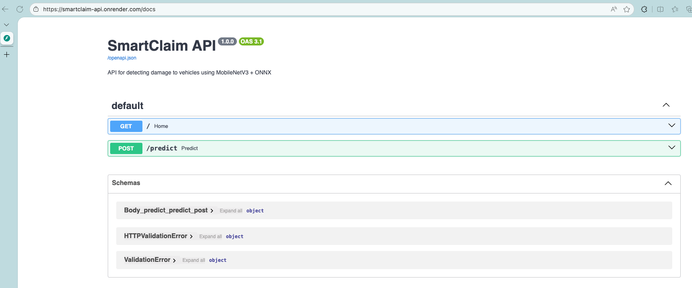

# SmartClaim: Automated Car Damage Detection

    

> **Capstone Project for Machine Learning Zoomcamp 2025**

## 📖 Problem Description
In the InsurTech industry, the "First Notice of Loss" (FNOL) is a critical bottleneck. Reviewing vehicle images manually to determine if a car is damaged or intact is slow, expensive, and prone to human error.

**SmartClaim** is a Machine Learning microservice designed to automate this triage process. It accepts an image of a vehicle and returns a classification (**Damaged** vs. **Whole**) along with a confidence score.

**Business Value:**
*   **Speed:** Instant feedback for users filing a claim.
*   **Cost Reduction:** Filters out obvious "non-damage" cases before a human adjuster is needed.
*   **Fraud Detection:** Validates the state of a car before a policy is signed.

---

## 🏗️ Technical Architecture
This project implements a robust MLOps pipeline, moving away from heavy research frameworks in production to lightweight inference.

1.  **Data Pipeline:** Automated ingestion from Kaggle, cleaning, and strict splitting (Train/Val/Test) to prevent data leakage.
2.  **Modeling:** Transfer Learning using **MobileNetV3 Small** (pretrained on ImageNet).
    *   *Reasoning:* MobileNetV3 offers the best balance between accuracy and latency for edge/web deployment.
3.  **Optimization:**
    *   Hyperparameter tuning performed to select best Learning Rate, Dropout, and Inner Layer size.
    *   Model exported to **ONNX** format to decouple the inference runtime from PyTorch (reducing Docker image size by ~500MB).
4.  **Deployment:**
    *   **API:** FastAPI (Asynchronous, Auto-documentation).
    *   **Container:** Multi-stage Docker build optimized with `uv` for dependency management.
    *   **Cloud:** Deployed on **Render** (Serverless).

---

## 📂 Project Structure

```text
smartclaim/
├── data/                  # Ignored by Git. Created automatically by scripts.
├── notebooks/
│   ├── eda.ipynb       # EDA, Feature Analysis.
│   ├── machine_learning_zoomcamp_capstone_project.ipynb    # Training Model & Hyperparameter Tuning in Google Colab
├── scripts/
│   ├── prepare_dataset.py # Downloads, cleans, and splits data (60/20/20).
│   ├── train.py           # Training pipeline (PyTorch) -> Exports ONNX.
│   ├── predict.py         # FastAPI App (Inference Logic).
│   └── test_api.py        # Script to test the deployed API.
├── Dockerfile             # Production-ready image definition.
├── Dockerfile.notebook    # Dev environment image definition.
├── docker-compose.yml     # Docker compose definition.
├── pyproject.toml         # Python dependencies managed by uv.
├── car_damage.onnx        # Initial Trained model.
├── car_damage.onnx.data   # Initial Trained model.
├── best_car_damage_model.onnx          # Best Trained model.
├── best_car_damage_model.onnx.data     # Best Trained model.
└── README.md
```

---

## 🚀 How to Run
1. **Prerequisites**
Docker installed.
Python 3.11+ (if running locally without Docker).
Kaggle Account: You need a kaggle.json API token placed in the root folder to download data.
Hot to get the Key (kaggle.json)

* Go to kaggle.com and log in (you can use your Google account).
* Click on your profile photo (top right) -> Settings.
* Scroll down until you find the "API" section.
Click on the "Create New Token (legacy)" button.
* A file called kaggle.json will automatically download to your computer.
* Move that file to the project's root folder.

2. **Dependency Management**
This project uses uv for lightning-fast package management, but includes requirements.txt for compatibility.

```bash
# Install uv (optional but recommended)
pip install uv
uv sync

# OR use standard pip
pip install -r requirements.txt
```

3. **Data Preparation**
Run the script to download the dataset from Kaggle, remove corrupt images, and split into Train/Val/Test.

```bash
uv run python scripts/prepare_dataset.py
```

You can also run the EDA notebook to clean the data (notebooks/eda.ipynb).
To do so, I provide a Jupyter notebook environment in a container.

```bash
docker-compose up -d --build jupyter
```

---

### 4. Full Training Pipeline (Dockerized) 🐳
To reproduce the entire MLOps cycle locally (Download Data -> Clean & Split -> Train -> Export), simply run the trainer container.

This pipeline will:
1.  **Download** the raw dataset from Kaggle (if not present).
2.  **Clean** corrupt images and **Split** into Train (60%) / Val (20%) / Test (20%).
3.  **Train** the MobileNetV3 model using the processed data.
4.  **Export** the final `best_car_damage_model.onnx` model to your project root.

**Run the pipeline:**
```bash
docker-compose up --build trainer
```

Output: This will overwrite best_car_damage_model.onnx and best_car_damage_model.onnx.data.

The training can be done also in Google Colab. To do so, you have a copy of the Google Colab used in notebooks/machine_learning_zoomcamp_capstone_project.ipynb, or you can access the Colab used at: https://colab.research.google.com/drive/1rJ5MoFTnYObJlO2PFY-V-qX7rsQKLuwv

5. **Running the API (Docker) - Recommended**
Build and run the production container. This simulates the exact cloud environment.

```bash
# Build the image
docker build -t smartclaim-api .

# Run container (Map port 9696)
docker run -it --rm -p 9696:9696 smartclaim-api
```

The API is now active at http://localhost:9696.

Testing in Local
You can test the deployed model using the provided script:

```bash
# Run the test
uv run python scripts/test_api.py
```

---

## ☁️ Cloud Deployment
The service is deployed on Render.

🔗 Live URL: https://smartclaim-api.onrender.com/docs
(Note: As it is a Free Tier service, the first request might take 50s to wake up the instance. Please be patient).


Testing the Cloud API
You can test the deployed model using the provided script:

```bash
# Run the test
uv run python scripts/test_api.render.py
```

---

## 📊 Methodology & Results
**Data Splitting Strategy**
To ensure honest evaluation, data was split before any EDA:

* **Train (60%)**: Used for learning and EDA.
* **Val (20%)**: Used for Hyperparameter Tuning (Early Stopping, LR selection).
* **Test (20%)**: Unseen data used only for final metrics.

**Hyperparameter Tuning**
We iterated over:

* **Learning Rates**: 0.001, 0.01, 0.1
* **Architecture**: Adjusting inner dense layer size (64, 128, 256) and Dropout rates (0.2, 0.5).

**Final Configuration:**

* Backbone: MobileNetV3 Small (Frozen)
* Inner Layer: 128 units
* Dropout: 0.3
* Optimizer: Adam (LR=0.01)
* Final Accuracy in Test Set: 90.97%

## 🛠️ Tech Stack Details
* **Language**: Python 3.11
* **Dependency Manager**: uv (Astral)
* **ML Framework**: PyTorch (Training), ONNX Runtime (Inference)
* **Web Framework**: FastAPI
* **Containerization**: Docker (Debian Bookworm Slim)
* **Cloud provider**: Render